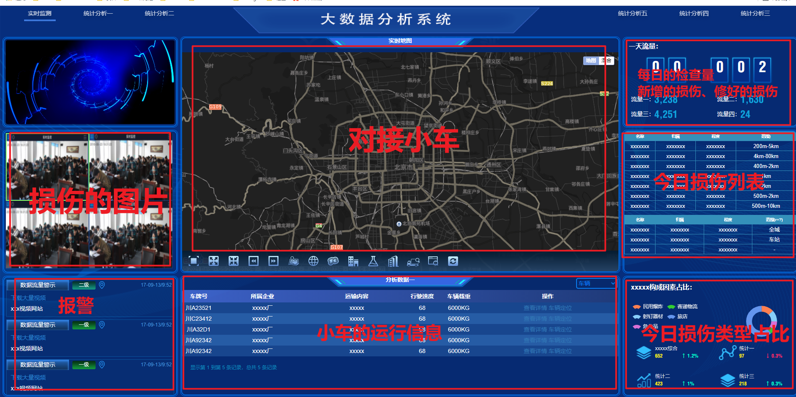
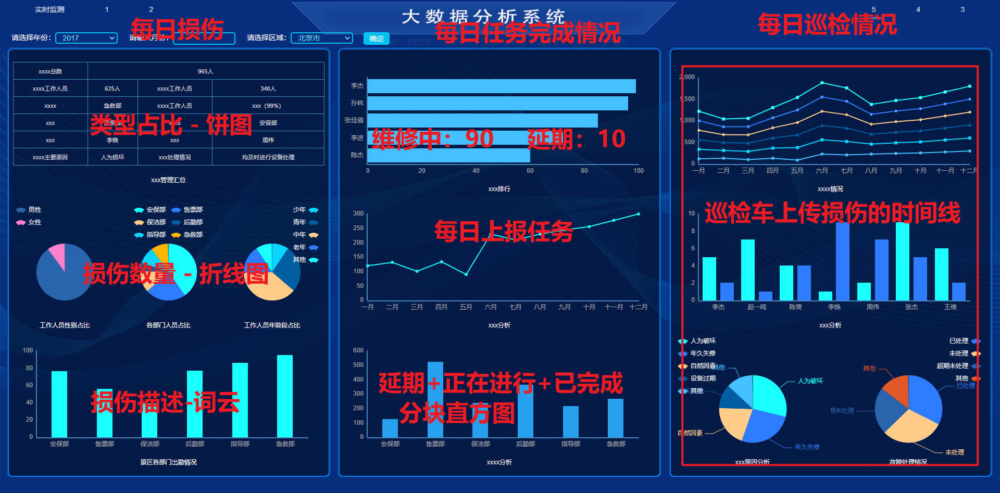
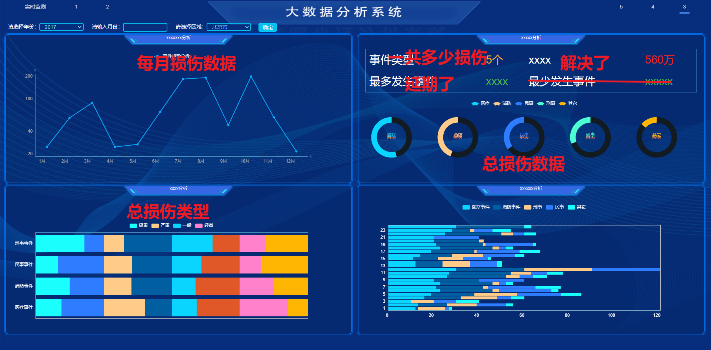

# README

[TOC]

## 前端修改的内容

### 实时监测 - 实时数据

### 每日汇总（按照时间排序）

### 历史数据汇总

### 【待定】每月汇总（按照日期排序）

## 仓库介绍

《大学生创新创业训练计划》的Web端，包括 前台数据报表、后台管理系统。

`/Dashboard` 是前台数据报表

`/Management` 是后台管理系统

`/Inspection` 是Java后端

## 开发环境

### 后端

| 软件                      | 版本号 |
| ------------------------- | ------ |
| JDK                       | 1.8    |
| SpringBoot                | 2.5.5  |
| Maven（依赖已经配置完毕） | 3.6.3  |
| MySQL                     | 8.0.24 |

### 前端

| 项目    | 版本  |
| ------- | ----- |
| X-Admin | 2.2   |
| LayUI   | 2.6.8 |

